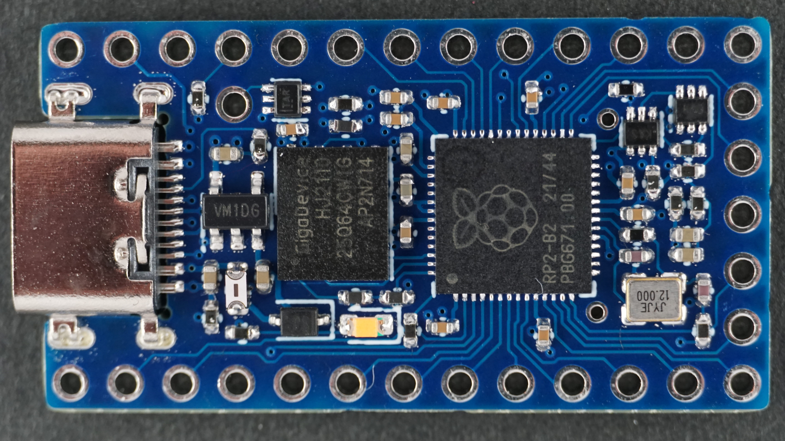
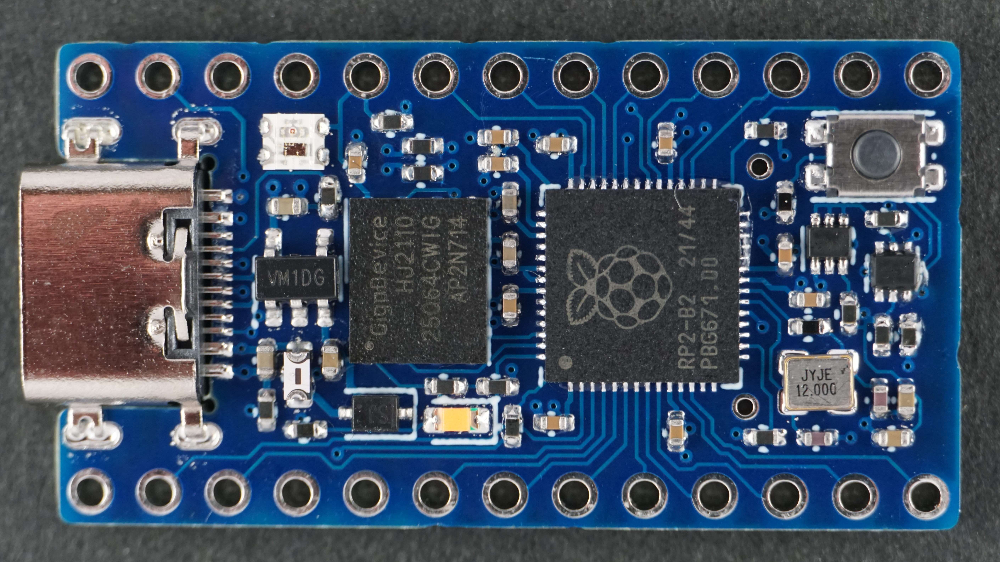
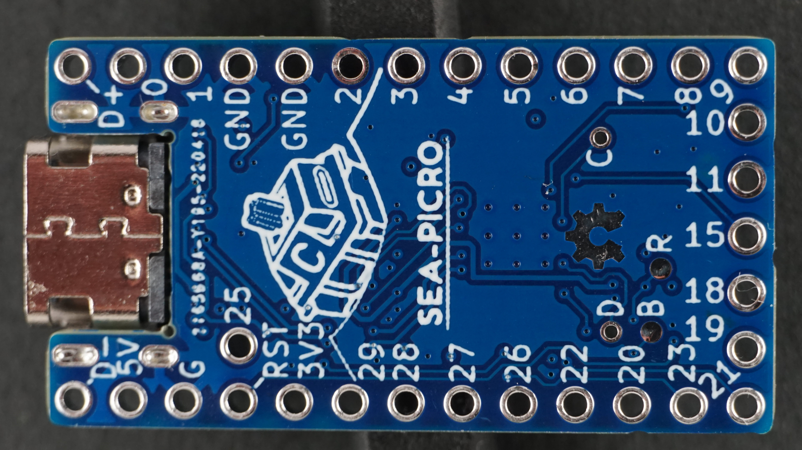
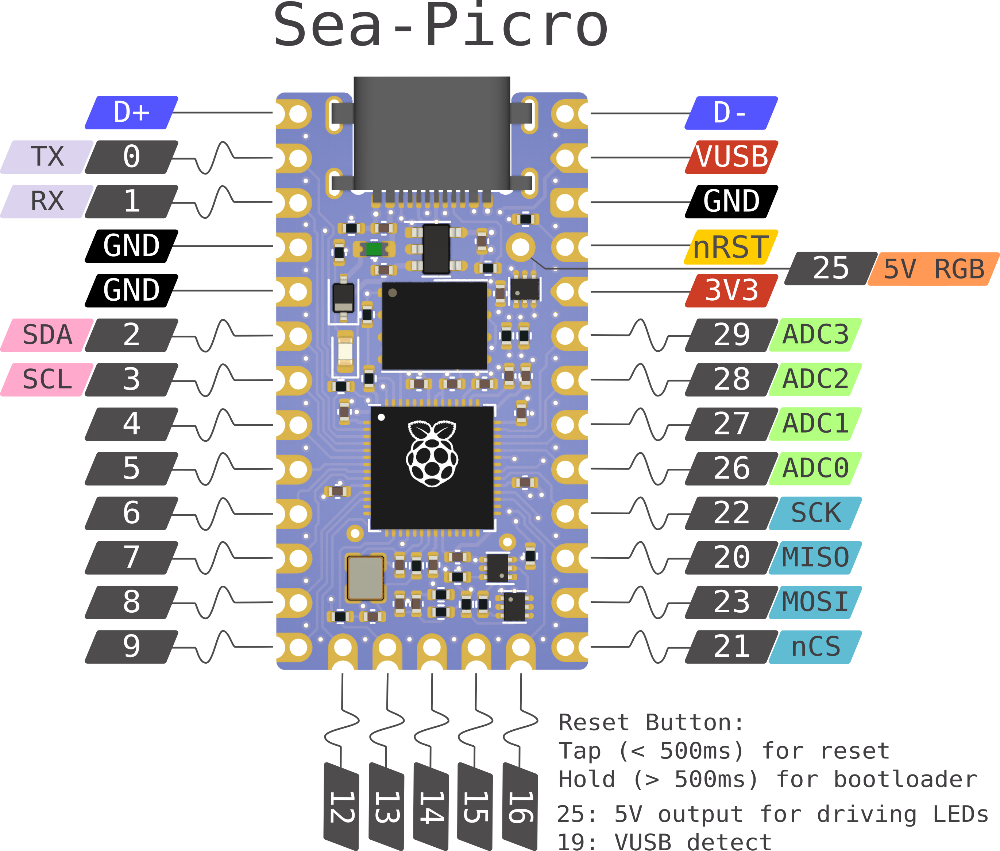

# Sea-Picro

Sea-Picro is a RP2040 based board in the Arduino Pro Micro form factor. Like [Sea-Micro](https://github.com/joshajohnson/sea-micro#sea-micro), it's designed to be a drop in replacement for keyboards wanting an upgrade from ATmega32u4 based pro micros.

There are two variants:
- EXT, featuring an Elite-C pinout, with dedicated 5V RGB LED pin, but without a reset button.
- RST, featuring a pro micro pinout, with onboard RGB LED and reset button.

**Sea-Picro EXT**

**Sea-Picro RST**

## Features
- Compatiable with any pro micro based keyboard (however requires new firmware)
- RP2040 microcontroller, with dual M0+ processors at up to 133MHz
- Mid mount USB-C connector, which is low profile and can't be ripped off
- Optional [Elite-C](https://deskthority.net/wiki/Elite-C) style pinout, adding an additional 5 IO for large keyboards
- Single button reset / bootloader circuit which changes behaviour based on how long it's held (RP2040 usually requires two buttons to flash new firmware, making it challenging when installed upside down in a keyboard)
- ROM bootloader which prevents board from being bricked
- Onboard power LED, along with a WS2812 LED for use with CircuitPython / as a status indicator on the RST version. EXT version has a 5V level shifter and extra pin to drive strings of WS2812 LEDs.
- IO pinout identical to the [Sparkfun RP2040 Pro Micro](https://www.sparkfun.com/products/18288)

## One Button Reset / Bootloader Circuit

One of the tricky things with the RP2040 is that unlike the pro micro, to update the firmware you need to use two buttons in sequence to put it into the bootloader. To get around this, I've designed a circuit which when tapped for less than 500ms will reset the board, but when held for 500ms or more will jump into the bootloader. This makes life much easier for keyboards that install the microcontroller upside down, or have limited access to the reset buttons on the micro.

## Manufacturing
Sea-Picro was designed with the goal of being assembled at JLCPCB, as it will ease sourcing for those who don't want to assemble the PCBs at home.

As such all of the components can be sourced from JLC's SMT parts library, with 8 of the components being basic parts, and 11 being extended. In quantity 50, each board comes out to $6 USD / $8 AUD + freight. (8th March 2022)

## Pinout

## Revision History
- V0.3 added castellated pads to the EXT version, along with changing the pinout to conform to the "BastardKB RP2040 Pinout". Numerous DFM improvements and bug fixes as per [#2](https://github.com/joshajohnson/sea-picro/issues/2).
- V0.2 added the one button reset / bootloader circuit, along with a number features and DFM improvements. Fixes [#1](https://github.com/joshajohnson/sea-picro/issues/1).
- V0.1 was more or less a clone of the Sparkfun RP2040, and was used as a refrence point for development. Tested and working, but not recomended for use.

## Contribuitors

- Michael Gard aka fig (@figthedevil / figurativelythedevil#4475) for adding castellated pads, teardrops, numerous DFM improvements, and feedback on the design.

## Contributing

If you want to download the project, ensure you clone `--recursive` as my parts library is pulled in as a submodule.

For any suggestions, areas of improvement, or problems you've found, please open an issue or pull request. I'm keen to make this board work for as many as people as possible, so please don't hesitate to suggest a change.