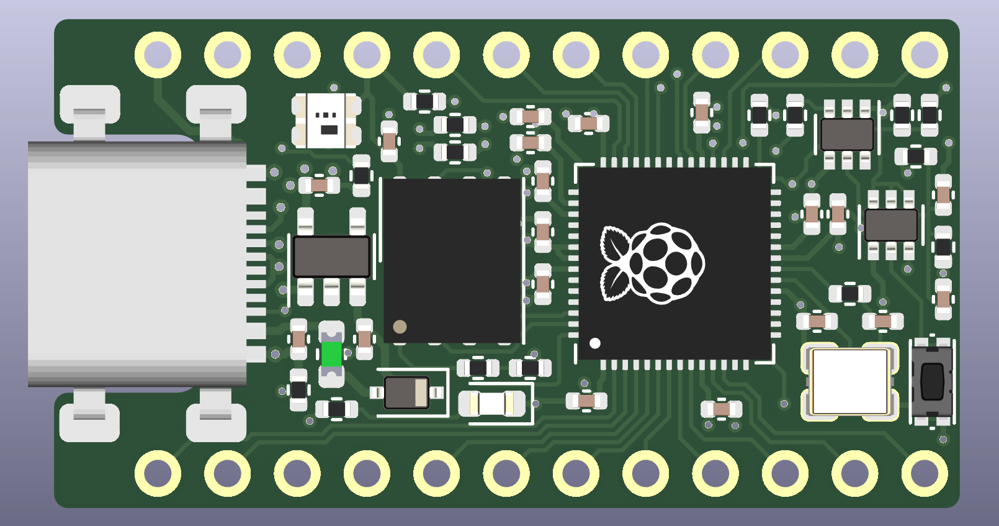
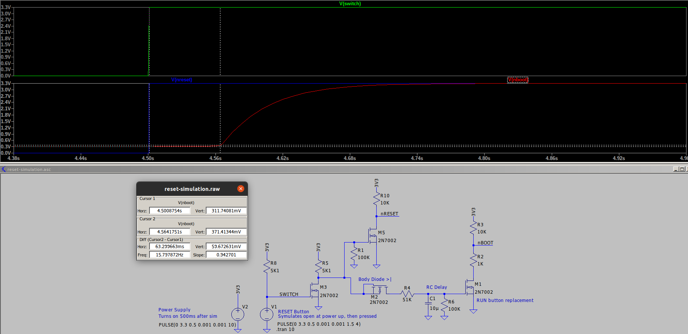

# Sea-Picro

Sea-Picro is a RP2040 based board in the Arduino Pro Micro form factor. Like [Sea-Micro](https://github.com/joshajohnson/sea-micro#sea-micro), it's designed to be a drop in replacement for keyboards wanting an upgrade from ATmega32u4 based pro micros.

## Features
- Compatiable with any pro micro based keyboard (requires new firmware)
- RP2040 microcontroller, with dual M0+ processors at up to 133MHz
- Mid mount USB-C connector, which is low profile and can't be ripped off
- ROM bootloader which prevents board from being bricked
- Single button reset / bootloader circuit which changes behaviour based on how long it's held (RP2040 usually requires two buttons to flash new firmware)
- Onboard power LED, along with a WS2812 LED for use with CircuitPython / as a status indicator
- Identical pinout to the [Sparkfun RP2040 Pro Micro](https://www.sparkfun.com/products/18288)

## Manufacturing
Sea-Picro was designed with the goal of being assembled at JLCPCB, as it will ease sourcing for those who don't want to assemble the PCBs at home.

As such all of the components can be sourced from JLC's SMT parts library, with 10 of the components being basic parts, and 9 being extended. In quantity 50, each board comes out to $6 USD / $8 AUD + freight. (8th March 2022)

## One Button Reset / Bootloader Circuit

One of the tricky things with the RP2040 is that unlike the pro micro, to update the firmware you need to use two buttons in sequence to put it into the bootloader. To get around this, I've designed a circuit which when tapped for less than 500ms will reset the board, but when held for 2 seconds or more will jump into the bootloader. 

At the time of writing the circuit as only been simulated, so is yet to be confirmed as working and may require tweaking of some component values for it to work properly. If you want to have a play with the simulation the LTSpice file is in `simulation/` along with screenshots of it's output for different switch times. 

Below is a screenshot of the circuit and simulation, showing a 60ms delay in nCS being pulled high after reset goes high, which is required to jump into the bootloader.

## Contributing

If you want to download the project, ensure you clone `--recursive` as my parts library is pulled in as a submodule.

For any suggestions, areas of improvement, or problems you've found, please open an issue. I'm keen to get feedback on how the board could be altered to suit more people, so please don't hesitate to suggest a change.

## Revision History
- V0.1 was more or less a clone of the Sparkfun RP2040, and was used as a refrence point for development. Tested and working, but not recomended for use.
- V0.2 added the one button reset / bootloader circuit, along with a number of DFM improvements. Development is ongoing.

### Revision 1 

